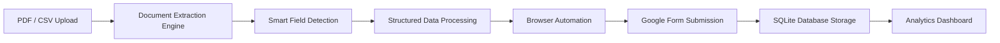

<div align="center">

# 🚀 AutoEntry AI

### 🤖 Intelligent Document Processing • Workflow Automation • Browser Automation


---

### 🔥 AI-Powered Workflow Automation Platform Built Using Intelligent Document Processing

Extract structured data from PDFs, resumes, invoices, and spreadsheets, then automatically fill and submit online forms using browser automation and AI-powered smart field matching.

</div>

---

# 🚀 Project Highlights

✅ AI-Powered Document Processing  
✅ PDF Resume & Invoice Extraction  
✅ Google Form Automation  
✅ Browser Automation Using Playwright  
✅ CSV Bulk Data Submission  
✅ Smart Dynamic Field Matching  
✅ SQLite Database Integration  
✅ Analytics Dashboard  
✅ OCR-Ready Architecture  
✅ Downloadable Submission Reports  
✅ Login Authentication System  
✅ Dark-Themed Professional UI  

---

# 🧠 AutoEntry AI Workflow



---

# 📸 System Preview

## 🔐 Login Interface

> Secure authentication system for protected workflow automation


## 📄 PDF Extraction Engine

> Extract Name, Email, Phone, and document information automatically


## 🤖 Browser Automation

> Automatically fills and submits Google Forms using extracted data


## 📊 Analytics Dashboard

> Monitor successful and failed submissions using real-time analytics


## 📜 Submission History

> Permanent submission tracking using SQLite database integration


---

# ⚡ Core Features

## 📄 Intelligent Document Processing
- Extracts structured data from PDF files
- Resume and invoice data extraction
- OCR-ready architecture
- Smart regex-based field detection

## 🤖 Browser Automation
- Google Form auto-fill automation
- Automatic browser control using Playwright
- Dynamic field matching
- Multi-record workflow automation

## 📊 Dashboard Analytics
- Submission success/failure tracking
- Analytics monitoring dashboard
- Real-time automation statistics
- Downloadable reports

## 📂 CSV Bulk Automation
- Upload CSV or spreadsheet files
- Batch form submission
- Bulk workflow automation
- Submission progress monitoring

## 🗄️ Database Integration
- SQLite persistent storage
- Submission history tracking
- Error logging
- Permanent automation records

## 🔐 Authentication System
- Login-protected dashboard
- Session-based authentication
- Secure workflow access

---

# 🛠️ Tech Stack

| Technology | Usage |
|---|---|
| Python | Core Backend Logic |
| Streamlit | Frontend Dashboard |
| Playwright | Browser Automation |
| SQLite | Database Persistence |
| Pandas | Data Processing |
| PyMuPDF | PDF Text Extraction |
| Regex | Smart Field Detection |
| VS Code | Development Environment |

---

# 📁 Project Structure

```bash
ai-data-entry-assistant/
│
├── app.py
├── requirements.txt
├── README.md
├── submission_history.db
│
├── automation/
│   └── form_filler.py
│
├── database/
│   └── db.py
│
├── utils/
│   └── document_extractor.py
│
├── screenshots/
│
├── sample_files/
│
└── .streamlit/
    └── config.toml
```

---

# ⚙️ Installation

## Clone Repository

```bash
git clone https://github.com/HarishRavikumar510/autoentry-ai.git
```

---

## Navigate to Project

```bash
cd autoentry-ai
```

---

## Create Virtual Environment

```bash
python -m venv venv
```

---

## Activate Virtual Environment

### Windows

```bash
venv\Scripts\activate
```

### Linux / Mac

```bash
source venv/bin/activate
```

---

## Install Dependencies

```bash
pip install -r requirements.txt
```

---

# ▶️ Run Application

```bash
python -m streamlit run app.py
```

---

# 📊 Sample Extracted Output

```json
{
  "Name": "Harish Ravikumar",
  "Email": "harish@gmail.com",
  "Phone": "9876543210"
}
```

---

# 🎯 Project Objectives

- Automate repetitive data entry workflows
- Build AI-powered document processing systems
- Simulate enterprise workflow automation
- Reduce manual form submission effort
- Create intelligent browser automation platform

---

# 🌟 Future Enhancements

- 🌍 OCR for scanned documents
- 📈 AI confidence scoring
- 🤖 Resume ranking system
- ☁️ Cloud deployment
- 📱 Mobile responsive dashboard
- 🔐 Multi-user authentication
- 📡 REST API integration
- 🧠 Handwriting recognition
- 📄 Aadhaar/PAN extraction

---

# 👨‍💻 Developed By

<div align="center">

## Harish Ravikumar

### Electronics and Communication Engineering Student  
### AI • Automation • IoT • Intelligent Systems Enthusiast

---

### 🌐 Connect With Me

GitHub:  
https://github.com/HarishRavikumar510

LinkedIn:  
https://www.linkedin.com/in/harish-ravikumar-70509524a/

</div>

---

# ⭐ Why This Project Stands Out

Unlike traditional automation demos, this project combines:

- Intelligent Document Processing
- Browser Automation
- PDF Extraction
- Workflow Orchestration
- Database Persistence
- Dashboard Analytics
- AI-Powered Field Detection
- Professional UI/UX

into a single integrated intelligent workflow automation platform.

---

# 📜 License

This project is developed for educational, research, portfolio, and learning purposes.

---

<div align="center">

# ⭐ If You Like This Project, Give It A Star ⭐

</div>
