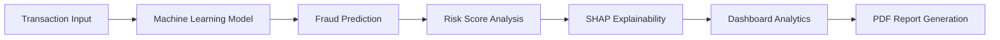
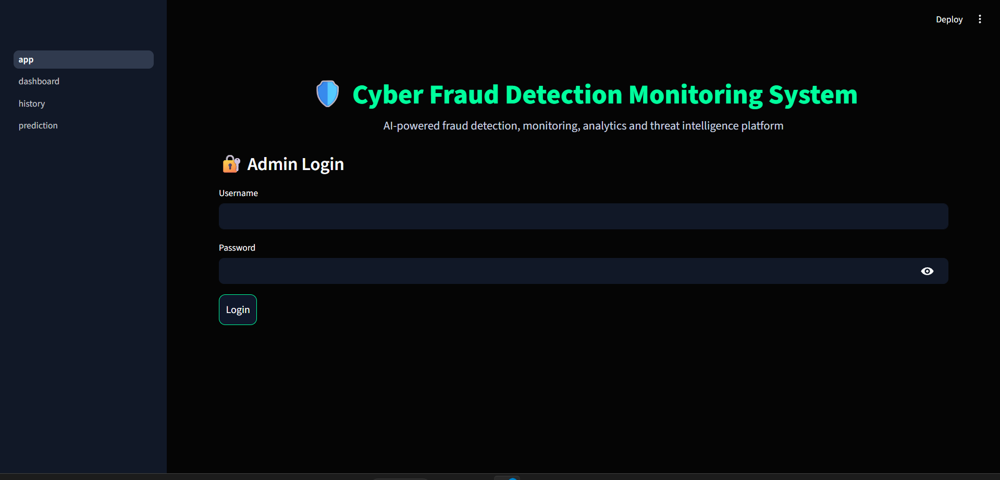
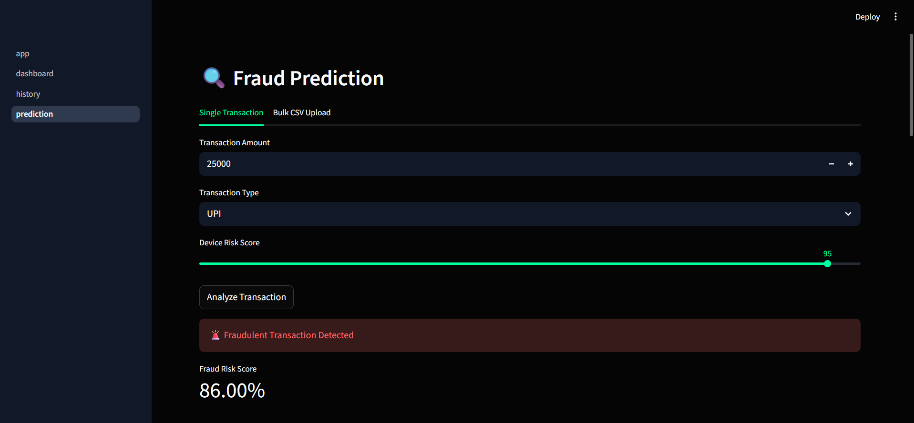
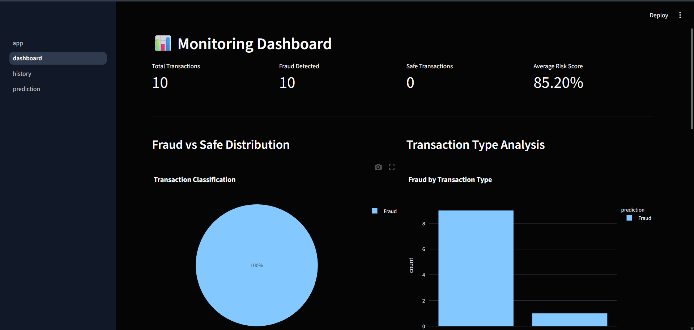
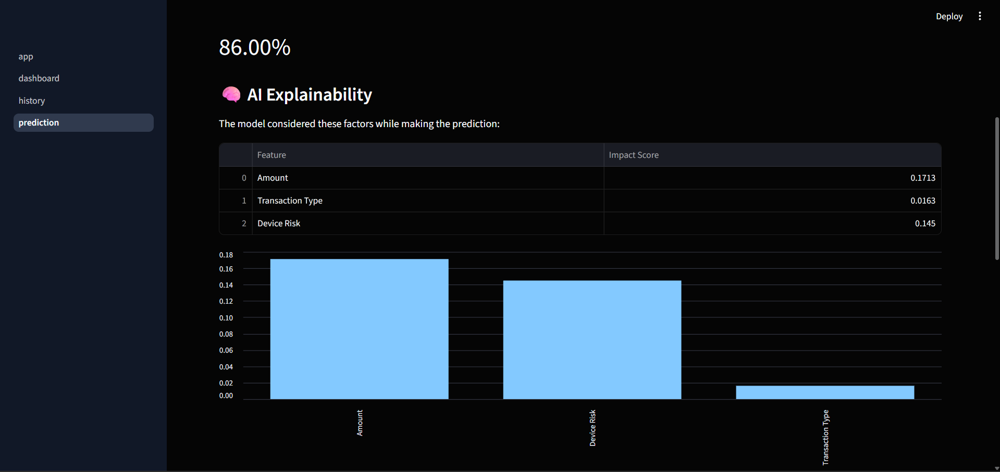

<div align="center">

# 🛡️ Cyber Fraud Detection Monitoring System

### 🚨 AI-Powered Fraud Detection • Explainable AI • Cybersecurity Analytics


---

### 🔥 Intelligent Cybersecurity Monitoring Platform Built Using Machine Learning

Detect suspicious financial transactions, analyze fraud risks, visualize fraud analytics, and generate AI-powered fraud monitoring reports using an interactive cybersecurity dashboard.

</div>

---

# 🚀 Project Highlights

✅ AI-Powered Fraud Detection  
✅ SHAP Explainable AI  
✅ Interactive Cybersecurity Dashboard  
✅ CSV Bulk Fraud Analysis  
✅ PDF Report Generation  
✅ SQLite Database Integration  
✅ Admin Authentication  
✅ Fraud Risk Scoring  
✅ Security Recommendations  
✅ Dark-Themed Professional UI  

---

# 🧠 AI Fraud Detection Workflow



---

# 📸 System Preview

## 🔐 Login Interface

> Secure admin authentication system

---

## 🔍 Fraud Prediction Engine

> Detect suspicious transactions using Machine Learning

---

## 📊 Monitoring Dashboard

> Real-time fraud analytics and visualization

---

## 🧠 Explainable AI (SHAP)

> Understand why the model predicts fraud

---

# ⚡ Core Features

## 🔍 Fraud Prediction
- Predicts fraudulent transactions using ML models
- Calculates fraud probability score
- Classifies transactions as Safe or Fraud

## 🧠 SHAP Explainability
- Visualizes feature impact
- Explains AI decision-making process
- Improves transparency and trust

## 📈 Dashboard Analytics
- Fraud vs Safe visualization
- Fraud risk trends
- Transaction type analysis
- High-risk monitoring

## 📂 Bulk CSV Analysis
- Upload multiple transactions
- Batch fraud analysis
- Download analyzed CSV reports

## 📄 PDF Report Generation
- Download professional fraud monitoring reports
- Includes fraud statistics and transaction logs

## 🗄️ Database Integration
- Stores prediction history
- Maintains transaction monitoring records

---

# 🛠️ Tech Stack

| Technology | Usage |
|---|---|
| Python | Core Backend Logic |
| Streamlit | Frontend Dashboard |
| Scikit-learn | Machine Learning |
| SHAP | Explainable AI |
| SQLite | Database |
| Pandas | Data Processing |
| Plotly | Interactive Charts |
| FPDF | PDF Report Generation |
| Joblib | ML Model Storage |

---

# 📁 Project Structure

```bash
Cyber-Fraud-Detection-System/
│
├── app.py
├── requirements.txt
├── README.md
│
├── data/
│   └── fraud_dataset.csv
│
├── models/
│   └── fraud_model.pkl
│
├── src/
│   ├── train_model.py
│   ├── database.py
│   └── report.py
│
├── pages/
│   ├── dashboard.py
│   ├── prediction.py
│   └── history.py
│
├── screenshots/
│
└── .streamlit/
    └── config.toml
```

---

# ⚙️ Installation

## Clone Repository

```bash
git clone https://github.com/your-username/Cyber-Fraud-Detection-System.git
```

---

## Navigate to Project

```bash
cd Cyber-Fraud-Detection-System
```

---

## Create Virtual Environment

```bash
python -m venv venv
```

---

## Activate Virtual Environment

### Windows

```bash
venv\Scripts\activate
```

### Linux / Mac

```bash
source venv/bin/activate
```

---

## Install Dependencies

```bash
pip install -r requirements.txt
```

---

# ▶️ Run Application

```bash
streamlit run app.py
```

---

# 📊 Sample Fraud Detection Input

```json
{
  "amount": 25000,
  "transaction_type": "UPI",
  "device_risk": 95
}
```

---

# 🎯 Project Objectives

- Detect suspicious financial transactions using AI
- Improve cybersecurity monitoring efficiency
- Build explainable and trustworthy fraud detection systems
- Simulate real-world fraud monitoring workflow

---

# 🌟 Future Enhancements

- 🌍 Geo-location fraud tracking
- 📈 Real-time monitoring
- 🤖 AI chatbot assistant
- ☁️ Cloud deployment
- 📱 Mobile responsive dashboard
- 🔐 OTP verification
- 📡 Live transaction streaming

---

# 👨‍💻 Developed By

<div align="center">

## Harish Ravikumar

### Electronics and Communication Engineering Student  
### AI • Cybersecurity • IoT • Machine Learning Enthusiast

---

### 🌐 Connect With Me

GitHub:  
https://github.com/HarishRavikumar510

LinkedIn:  
https://www.linkedin.com/in/harish-ravikumar-70509524a/

</div>

---

# ⭐ Why This Project Stands Out

Unlike traditional fraud detection demos, this project combines:

- Machine Learning
- Explainable AI
- Cybersecurity Monitoring
- Dashboard Analytics
- Database Logging
- Report Generation
- Professional UI/UX

into a single integrated intelligent monitoring platform.

---

# 📜 License

This project is developed for educational, research, portfolio, and learning purposes.

---

<div align="center">

# ⭐ If You Like This Project, Give It A Star ⭐

</div>